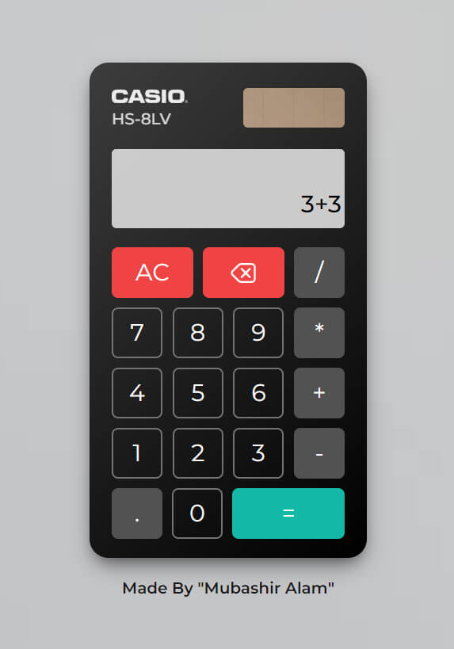

# Calculator with React.js

This is a simple calculator project created using React.js with Vite and Tailwind CSS.

## Live Demo

Check out the live demo of the calculator [here](https://reactcasiocalculator.netlify.app/).

## Screenshots





## Features

- Addition, subtraction, multiplication, and division operations.
- Backspace feature to remove the last entered digit.
- Clear button to reset the calculator.
- Responsive design for different screen sizes.

## Installation

1. Clone the repository:

   ```bash
   git clone https://github.com/MubashirAlam89/calculator-using-react-js.git
   ```

2. Navigate to the project directory:
   ```bash
   cd react-calculator
   ```
3. Install the dependencies::

   ```bash
   npm install
   ```

4. Start the development server::
   ```bash
   npm run dev
   ```

## Usage

1. Enter numbers and perform calculations using the calculator's buttons.
2. Click the "=" button to see the result of the operation.
3. To remove the last entered digit, use the backspace button.
4. To clear the calculator, click the "C" button.

## Technologies Used

- React.js - A JavaScript library for building user interfaces.
- Vite - A fast development server and build tool for modern web applications.
- Tailwind CSS - A utility-first CSS framework for rapid UI development.

<br>
<hr>

made with &#128151; by "Mubashir Alam".
